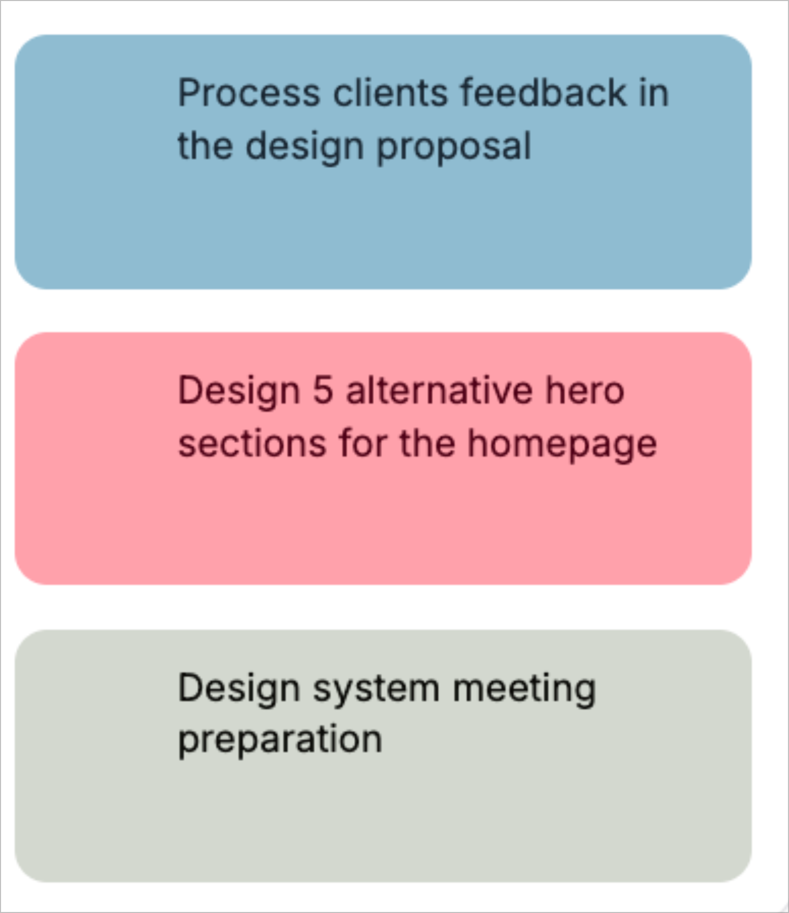

# SPEC: UX Design

v2 | Mar 09 2026 - 08:05 PM (MST)

## Overview

Design system reference for Meet Assist, generated from UI Colors (uicolors.app). All components use the steel/rose/sage color palette with Tailwind CSS v4, shadcn/ui components, and Lucide React icons.

**Source:** UI Colors Tailwind CSS Color Generator — Palette 17

## Color Palette — Tailwind CSS v4

Add to your main CSS file with `@theme`:

```css
@import "tailwindcss";

@theme {
  --color-steel-50: #f1f7fa;
  --color-steel-100: #dcebf1;
  --color-steel-200: #bdd8e4;
  --color-steel-300: #8fbcd1;
  --color-steel-400: #4c8bab;
  --color-steel-500: #3f7b9b;
  --color-steel-600: #376483;
  --color-steel-700: #32546c;
  --color-steel-800: #2f475b;
  --color-steel-900: #2b3d4e;
  --color-steel-950: #192733;

  --color-rose-50: #fff0f1;
  --color-rose-100: #ffe3e5;
  --color-rose-200: #ffcad1;
  --color-rose-300: #ff9fab;
  --color-rose-400: #ff6980;
  --color-rose-500: #fe3557;
  --color-rose-600: #ec1242;
  --color-rose-700: #c80837;
  --color-rose-800: #a70a36;
  --color-rose-900: #8e0d35;
  --color-rose-950: #500117;

  --color-sage-50: #f9faf9;
  --color-sage-100: #f4f5f4;
  --color-sage-200: #e5e8e3;
  --color-sage-300: #d3d8cf;
  --color-sage-400: #a2ac9a;
  --color-sage-500: #636e5b;
  --color-sage-600: #4f5b4a;
  --color-sage-700: #3e4739;
  --color-sage-800: #282b22;
  --color-sage-900: #191e15;
  --color-sage-950: #0a0d08;
}
```

| Role      | Name    | Primary Hex | Usage                                        |
|-----------|---------|-------------|----------------------------------------------|
| Primary   | `steel` | `#4c8bab`   | Buttons, links, focus rings, primary actions |
| Secondary | `rose`  | `#fe3557`   | Alerts, destructive actions, accents         |
| Tertiary  | `sage`  | `#636e5b`   | Muted backgrounds, secondary text, borders   |

## Cards


### Meet Assist — Chat Cards (chat-card.tsx)

Starting point for the live stream transcript cards in meet-assist.



Layout reference (not for color — for structure):


**Layout:**

```txt
┌─────────────────────────────────┐
│  Utterance text goes here.      │
│  Full text — never truncated.   │
│                                 │
│  Speaker_0              [ ⎘ ]   │
└─────────────────────────────────┘
```

- Card height grows to fit full utterance text — no truncation, no ellipsis
- Even padding on all sides (consistent `p-4`)
- **Top:** utterance text
- **Bottom-left:** speaker name
- **Bottom-right:** copy-to-clipboard button (Lucide `Copy` icon)
- Background color assigned per speaker (steel-300, rose-300, sage-300)

## Buttons

All three color roles (steel, rose, sage) in variants: Modern, Classic, Solid, Soft, Surface, Outline. Each variant shows Default, Hover, Active, and Disabled states.


## Callouts

Feedback banners in Solid, Soft, Surface, and Outline variants across all three colors.


## Form Controls

Checkboxes, radio buttons, switches, range sliders, and text inputs — each styled per color role.


## Links, Progress Bars, Tabs

Inline link styles with accessibility contrast notes (APCA LC 60+), progress bars, and tab navigation.


## Alerts, Avatars, Badges

Alert banners (solid/soft), avatar styles (solid/soft/gradient), and badge variants.


## Headings

Typography specimens showing heading styles across all three color roles on white and tinted backgrounds.


